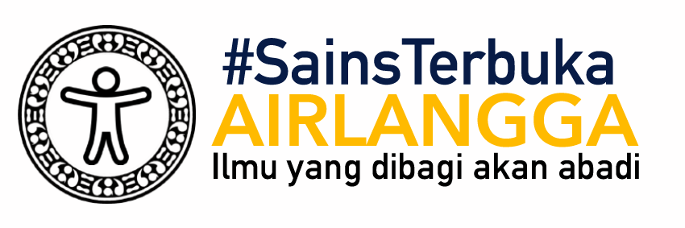

class: inverse, middle, title-slide, spaced

```{r setup, include=FALSE}
library(fontawesome)
library(tidyverse)
library(emo)
options(htmltools.dir.version = FALSE, width=120)
```

class: title-slide, spaced

   

# Workshop Latent Variable Modeling (LVM)
## Menggunakan `JASP`: Bagian 3 - Model Jalur (*Path Model*) dan Model Regresi
<br>
### <b>Rizqy Amelia Zein</b>
* Dosen, [Fakultas Psikologi, Universitas Airlangga](https://psikologi.unair.ac.id)
* Anggota, [#SainsTerbuka Airlangga](https://sainsterbukaua.github.io/) `r fa("universal-access")`
* Relawan, [INA-Rxiv](https://inarxiv.id) 
* Researcher-in-training, [Institute for Globally Distributed Open Research and Education (IGDORE)](https://igdore.org/)

---

class: inverse

# Analisis jalur

* *Path model* merupakan kelanjutan dari model regresi karena terdiri dari **beberapa model regresi** sekaligus sehingga dapat digunakan untuk menguji *direct*, *indirect*, dan *correlated effects*.

* *Path model* disusun secara visual dengan aturan tertentu (konsensus)
  - Garis satu arah menggambarkan *direct effects*, yang merefleksikan *keterkaitan langsung* antara satu variabel dengan variabel lainnya. Asumsinya, **tidak ada variabel lain diluar model** yang berkorelasi dengan variabel tersebut.
  - Garis dua arah menggambarkan *covariance*/korelasi, yang mengimplikasikan bahwa keterkaitan antar-variabel masih mungkin ditentukan oleh **variabel lain yang tidak ada di dalam model**.
  - Garis *error terms* yang menunjukkan varians *observed variable* yang menjelaskan **variabel lain yang tidak dapat dijelaskan/di luar model**, yang juga mewakili **measurement error**.

---

# Korelasi = kausalitas?

.pull-left[

* Analisis jalur sebenarnya adalah **bentuk yang lebih kompleks** dari korelasi, dan **yang perlu diingat**:

### **Correlation does not imply causation**

Yang harus dipenuhi sebagai bukti kausalitas:
* Ada **urutan waktu** (*temporal order*) `r fa("arrow-circle-right")` maka desain penelitian *panel*/*longitudinal*/*time series* harus digunakan
* Adanya **korelasi** (*covariance*) antara kedua variabel
* Peneliti harus melakukan **kontrol** atas variabel lain yang mungkin menjelaskan korelasi tsb (melakukan manipulasi, mengestimasi *part* atau *partial correlation*)
* Peneliti melakukan **manipulasi** pada variabel X, yang menyebabkan perubahan pada variabel Y

]

.pull-right[


]

---

# Diagram jalur 

<center></center><br>

---

class: inverse, middle

# Contoh

.pull-left[

Marimar adalah seorang wali murid di sebuah PAUD di Kota Surabaya. Pada suatu hari, ia mengamati seorang anak (dan orangtua) yang perilakunya menarik perhatiannya. 

Ibu anak tersebut *ngotot* untuk menunggui anaknya di sekolah, padahal guru kelas meminta agar Ibu pulang saja, mempercayakan anak pada guru, dengan tujuan melatih kemandirian anaknya. 

Melihat ibunya yang menggerutu karena diminta bu Guru pulang, si anak menangis meraung-raung tidak mau ditinggalkan. Akhirnya, terpaksa bu Guru membiarkan si Ibu menunggu di sekolah. 

Marimar heran sekaligus penasaran, mengapa tiap anak **memberikan respon yang berbeda** ketika ditinggal orangtuanya di sekolah. Ada yang menangis meraung-raung, ada yang lebih santai dengan langsung bermain. Apakah ada kaitan antara kemandirian anak dengan karakteristik orangtuanya?

]

.pull-right[


]

---

# Variabel yang diukur Marimar

* **trust** (variabel independen) = Kepercayaan ibu bahwa perkembangan anak dapat berlangsung secara natural ([**trust in organismic development**](https://link.springer.com/article/10.1007/s11031-008-9092-2)). Diukur dengan skala *likert* yang terdiri dari 5 aitem dengan 7 pilihan respon `r fa("arrow-circle-right")` dari **sangat tidak setuju** sampai **sangat setuju**.

* **mandiri** (variabel dependen) = Tingkat kemandirian anak. Anak dengan skor yang tinggi semakin menunjukkan independensi dan lebih santai ketika ditinggal orangtuanya di sekolah. Marimar mengukurnya dengan melakukan observasi berdasarkan ada/tidaknya berbagai perilaku yang menunjukkan kemandirian. Diantaranya adalah:
  - Menangis ketika ditinggal orangtuanya
  - Merengek atau merajuk ketika ditinggal
  - Masuk ke dalam kelas tanpa ditemani
  - Menaruh tas dalam loker yang disediakan tanpa bantuan pengantar

### Bagaimana bentuk diagram jalurnya?

---

class: center, middle

<center></center><br>

---

# Nama variabel dan koefisien jalur

| Nama Variabel/Koefisien | Huruf Yunani | Huruf Latin|
| --------- | :------------: | :----------: |
| *Error* pengukuran dari variabel X | δ | Delta |
| *Error* pengukuran dari variabel Y | ε | Epsilon |
| Variabel eksogen | ξ | Ksi |
| Variabel endogen | η | Eta |
| *Direct effect* antara variabel laten dan indikatornya (*loading factor*) | λ | Lambda |
| *Direct effect* antara variabel endogen dan eksogen | γ | Gamma |
| *Direct effect* antara dua variabel laten | β | Beta |
| Korelasi (*covariance*) antara dua variabel laten | φ | Phi |
| Varians *error* pengukuran dari sebuah variabel laten | ζ | Zeta |

---

## Contoh model dengan koefisien jalur

<center></center><br>

---

## TUGAS 1: Membuat diagram jalur

.pull-left[

Fernando Jose sebal sekali karena ia kembali kehilangan pengokotnya dan ini kali ketiga ia kehilangan pengokot yang baru dibelinya seminggu yang lalu. 

Teman-teman kerjanya memang punya kebiasaan buruk meminjam barang tanpa seijinnya. Ia akhirnya bertanya, apa ya yang menyebabkan teman-temannya berperilaku seperti itu? 

Akhirnya ia menduga, mungkin ada kaitannya dengan faktor kepribadian (*conscientiousness*) rekan kerjanya dan usia karyawan.

Ia menduga temannya yang lebih *conscientious* dan lebih tua akan lebih kecil kemungkinannya melakukan perilaku tidak beradab. Ia juga mengamati bahwa semakin tua usia rekan kerjanya, biasanya mereka lebih *conscientious*.

]

.pull-right[


]

---

# Yang diukur...

* **con** = Kecenderungan *conscientiousness* karyawan. Makin tinggi skornya, karyawan lebih mungkin menunjukkan kehati-hatian dan keteraturan dalam bekerja, efisien, dan bertanggung jawab. Diukur dengan skala *Likert* berisi 6 aitem dengan 10 pilihan jawaban.

* **incivil** = Intensitas perilaku tidak beradab. Makin besar skornya, karyawan akan lebih mungkin *emotionally abusive*, suka mengambil barang teman tanpa ijin, dan perilaku tidak pantas yang lain. Diukur dengan skala *Likert* berisi 4 aitem dengan 10 pilihan jawaban.

* **usia** = Usia partisipan

### Buatlah diagram jalur beserta koefisien jalurnya. Bisa dengan `MS PowerPoint` atau *software* yang lain.

[[Unggah file diagram jalur disini]](https://forms.gle/VpBzNxT26zXsBBAJ6)

---

# `lavaan` *Syntax*

* `JASP` mengadopsi *syntax* dari *package* [`lavaan`](http://lavaan.ugent.be/tutorial/index.html), sehingga untuk menjalankan programnya, kita harus memasukkan serangkaian perintah.

* Meskipun begitu, *syntax* `lavaan` sangat sederhana dan familiar dengan *syntax* `lavaan` memberikan banyak keuntungan.

* Menjalankan perintah dengan *syntax* juga membantu peneliti untuk mereka-ulang hasil analisis datanya, serta mempermudah kolaborasi dengan peneliti yang terbiasa menggunakan perangkat lunak yang berbeda dengan kita.

---

# Dasar *syntax* `lavaan`<sup>*</sup>

<center></center><br>

.footnote[

<sup>*</sup> Baujean, A.A. (2014). Latent Variable Modeling Using R: A step-by-step guide. New York: Routledge.

]

---

# Contoh CFA (1)

<center></center><br>

---

class: middle

```{r eval=FALSE, tidy=FALSE}

# CFA
trust =~ trust1 + trust2 + trust3 + trust4 + trust5

# Measurement error (residual)
trust1 ~~ trust1
trust2 ~~ trust2
trust3 ~~ trust3
trust4 ~~ trust4
trust5 ~~ trust5
trust ~~ trust

```

---
  
# Contoh CFA (2)

<center></center><br>

---

class: middle

```{r eval=FALSE, tidy=FALSE}

# CFA
mandiri =~ mandiri1 + mandiri2 + mandiri3 + mandiri4

# Measurement error (residual)
mandiri1 ~~ mandiri1
mandiri2 ~~ mandiri2
mandiri3 ~~ trust3
mandiri4 ~~ mandiri4
mandiri ~~ mandiri

```


---

# Contoh *path analysis* (3)

<center></center><br>

---

class: middle

```{r eval=FALSE, tidy=FALSE}

# Model Struktural

mandiri ~ trust

# Measurement error (residual)

mandiri ~~ mandiri
trust ~~ trust

```


---

# Contoh *full model* (4)

<center></center><br>

---

class: middle

```{r eval=FALSE, tidy=FALSE}

# CFA
mandiri =~ mandiri1 + mandiri2 + mandiri3 + mandiri4
trust =~ trust1 + trust2 + trust3 + trust4 + trust5

# Measurement error (residual)
mandiri1 ~~ mandiri1
mandiri2 ~~ mandiri2
mandiri3 ~~ mandiri3
mandiri4 ~~ mandiri4

trust1 ~~ trust1
trust2 ~~ trust2
trust3 ~~ trust3
trust4 ~~ trust4
trust5 ~~ trust5

trust ~~ trust
mandiri ~~ mandiri

# Model Struktural
mandiri ~ trust


```

---

# TUGAS 2: Menulis *syntax* `lavaan`

### Tulislah *syntax* `lavaan` dari diagram jalur yang sudah dibuat di TUGAS 1

#### [Klik disini untuk mengisi lembar kerja](https://forms.gle/ARMzU4trUgqRv8hj9)

---

class: center, middle

# Terima kasih banyak! `r emo::ji("wink")`


Paparan disusun dengan menggunakan `r fa("r-project")` *package* [**xaringan**](https://github.com/yihui/xaringan) dengan *template* dan *fonts* dari `R-Ladies`.

*Chakra* dibuat dengan [remark.js](https://remarkjs.com), [**knitr**](http://yihui.name/knitr), dan [R Markdown](https://rmarkdown.rstudio.com).