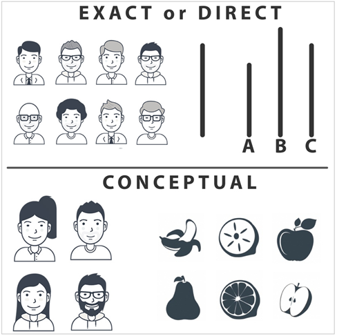
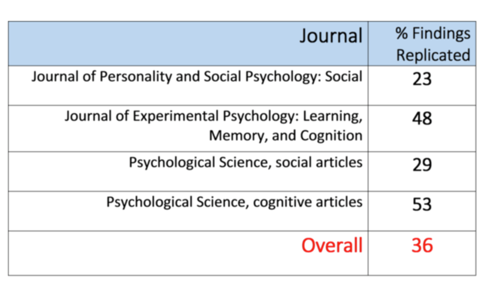
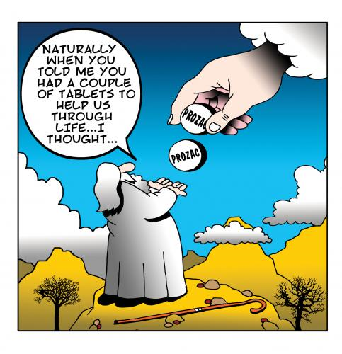
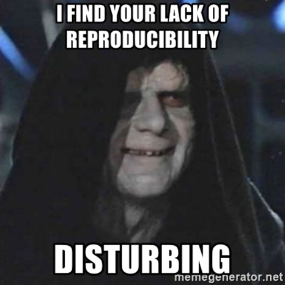

class: inverse, middle, title-slide, spaced

```{r setup, include=FALSE}
library(fontawesome)
library(tidyverse)
library(emo)
options(htmltools.dir.version = FALSE, width=120)
```

class: title-slide, spaced

  

# Kursus Mandiri Metasains
## Bagian 1:
### Krisis Replikasi, Revolusi Kredibilitas, dan Pengantar Metasains
<br>
### <b>Rizqy Amelia Zein</b>
* Dosen, [Fakultas Psikologi, Universitas Airlangga](https://psikologi.unair.ac.id)
* *Co-founder*, [#SainsTerbuka Airlangga](https://sainsterbukaua.github.io/) `r fa("universal-access")`
* *Researcher-in-training*, [Institute for Globally Distributed Open Research and Education (IGDORE)](https://igdore.org/)

---

class: center, middle

# Menghubungi saya?  

`r fa("paper-plane")` <a href="mailto:amelia.zein@psikologi.unair.ac.id"></i>&nbsp; amelia.zein@psikologi.unair.ac.id</a>
`r fa("twitter")` [@ameliazein](https://twitter.com/ameliazein)
`r fa("github")` [@rameliaz](https://github.com/rameliaz)
`r fa("desktop")` https://rameliaz.github.io


Materi dalam paparan ini berlisensi `r fa("creative-commons")` 4.0 ([CC-BY-NC 4.0](https://creativecommons.org/licenses/by-nc/4.0/)) dan tersedia di laman web kursus **(https://sainsterbukaua.github.io/meta-analysis/)**. 
Kode tersedia secara terbuka di [repositori](https://github.com/sainsterbukaUA/meta-analysis) `r fa("github")` Sains Terbuka Airlangga

---

class: inverse, middle, center


---

## Krisis Replikasi `r emo::ji("astonished")`

* Bayangkan anda sedang berjalan di Jalan Dharmawangsa dan sekilas melihat seseorang yang mirip dengan mantan anda.

--

* Pada pengamatan pertama, anda mungkin **tidak terlalu yakin** orang tersebut adalah mantan anda.

--

* Namun setelah **pengamatan berulang**, misalnya dengan memutar jalan dan melihatnya lagi yang **kedua**, **ketiga**, dan seterusnya, maka anda akan **lebih yakin** orang tersebut adalah/bukan mantan anda.

--

* Temuan riset akan **dinilai kredibel** apabila tim peneliti lain sukses mendapatkan temuan yang sama ketika **analisis diulang** atau **pengambilan data** diulang kembali (dengan protokol yang kurang lebih sama).

--

* Namun sayangnya, ada banyak sekali temuan penelitian yang lazim dipercayai, utamanya di Psikologi, gagal ditemukan kembali ketika dicoba-ulang oleh tim peneliti yang berbeda.

--

* ...sehingga menciptakan kondisi yang disebut juga dengan [**krisis replikasi**](https://nobaproject.com/modules/the-replication-crisis-in-psychology).

--

* **Tidak hanya di Psikologi**, krisis ini juga ditemukan [di banyak disiplin ilmu lainnya](https://www.pnas.org/content/115/11/2628.short).

---

## Mengapa hal ini bisa terjadi?

[Gomez, Juristo, & Vegas (2010)](https://www.researchgate.net/publication/221494837_Replications_types_in_experimental_disciplines) menengarai ada setidaknya **lima penyebab** mengapa krisis ini bisa terjadi.

--

* **Lokasi penelitian** tempat dilakukannya penelitian coba-ulang (replikasi) berbeda dengan tempat dilakukannya penelitian pada penelitian asalnya.

--

* **Peneliti (eksperimenter)** yang melakukan penelitian bisa saja orang yang sama, orang yang samasekali berbeda, atau bahkan kombinasi antara peneliti yang sama dan berbeda dari penelitian asalnya.

--

* **Perangkat (aparatus)** penelitian yang digunakan, misalnya desain (protokol) penelitian, material studi, instrumen, dan perangkat lainnya yang digunakan di penelitian coba-ulang berbeda dengan penelitian asalnya.

--

* **Operasionalisasi** yang digunakan peneliti ketika melakukan coba-ulang berbeda dengan penelitian asalnya, dalam hal pengukuran variabel. Misalnya, penelitian coba-ulang dan penelitian asal menggunakan dua instrumen yang berbeda (PHQ-9 dan BDI) untuk mengukur variabel yang sama (depresi).

--

* Terakhir, perbedaan temuan penelitian mungkin dipengaruhi oleh **karakteristik populasi** yang berbeda.

---

## Coba-ulang (*Replicable*) $\neq$ Reka-ulang (*Reproducible*) `r emo::ji("loudspeaker")`

* ...meskipun kedua istilah ini sering digunakan bergantian.

--

* **Coba-ulang (*Replicable*)** `r fa("arrow-circle-right")` desain (protokol) penelitian sama, pengambilan data dilakukan di tempat yang berbeda, dilakukan oleh tim peneliti yang berbeda sehingga menghasilnya data yang berbeda (independen) dari penelitian asalnya. 
  - **Data berbeda, peneliti berbeda**.

--

* **Reka-ulang (*Reproducible*)** `r fa("arrow-circle-right")` desain (protokol) penelitian sama, data penelitian dari studi asal dianalisis kembali oleh tim penelitian yang berbeda. 
  - **Data sama, tim peneliti berbeda**.

---

## Penelitian Replikasi 

* Umumnya dapat dilakukan dengan **dua cara**<sup>1</sup> yang berbeda, yaitu:
  - *Direct replication*
  - *Conceptual replication*

<center></center>

.footnote[

<sup>1</sup> Diener, E. & Biswas-Diener, R. (2020). [The replication crisis in psychology](http://noba.to/q4cvydeh). In R. Biswas-Diener & E. Diener (Eds), Noba textbook series: Psychology. Champaign, IL: DEF publishers.

]

---

class: center

<center></center>

.footnote[

LeBel, E. P., McCarthy, R. J., Earp, B. D., Elson, M., & Vanpaemel, W. (2018). [A unified framework to quantify the credibility of scientific findings](https://journals.sagepub.com/doi/abs/10.1177/2515245918787489). Advances in Methods and Practices in Psychological Science, 1(3), 389-402.

]

---

## Krisis Replikasi di Psikologi

<center></center>


.footnote[

Diener, E. & Biswas-Diener, R. (2020). [The replication crisis in psychology](http://noba.to/q4cvydeh). In R. Biswas-Diener & E. Diener (Eds), Noba textbook series: Psychology. Champaign, IL: DEF publishers.

]

---

## Reproducibility Project: Psychology (RP:P)<sup>1</sup>

<center></center>

.footnote[

<sup>1</sup> Open Science Collaboration. (2015). [Estimating the reproducibility of psychological science](http://osf.io/ezcuj). Science, 349(6251), aac4716.

]

---

class: inverse, center

## Kasus Fluoxetine `r emo::ji("pill")`

<center></center>

---

## Kasus Fluoxetine `r emo::ji("pill")`

* Fluoxetine adalah obat antidepresan yang sangat populer dan menghasilkan penjualan hingga miliaran dolar US hanya di Amerika Serikat saja.

--

- Namun, sebuah [studi meta-analisis](https://doi.org/10.1371/journal.pmed.0050045) cenderung amat kecil bahkan mengarah ke *placebo*.

--

- Para ahli [sepakat menyimpulkan](http://www.sciencemag.org/news/2008/02/problem-Prozac) bahwa Prozac tidak bermanfaat untuk merawat pasien dengan gejala depresi.

--

- Mengapa ini bisa terjadi? Salah satu penyebabnya adalah **bias publikasi**, yaitu peneliti hanya [menerbitkan temuan penelitian yang positif](https://www.youtube.com/watch?v=9fm6wHTYjAA) saja sehingga menghasilkan kesimpulan yang keliru.

---

## Kasus Fluoxetine `r emo::ji("pill")`

[Ioannidis (2008)](https://peh-med.biomedcentral.com/articles/10.1186/1747-5341-3-14) menyimpulkan bahwa riset klinis obat-obat antidepresan cenderung menyuguhkan hasil yang keliru karena:

* Kesalahan peneliti dalam menginterpretasi [**signifikansi statistik** (*p-value*)](https://link.springer.com/10.1007/s10654-016-0149-3)

* Protokol (desain) penelitian yang terdistorsi atau mungkin dimanipulasi

* [*Sampling bias*](https://en.wikipedia.org/wiki/Sampling_bias)

* Peneliti melakukan studi *follow-up* tidak lama setelah intervensi diberikan

* *Selective* atau *distortive report*, yaitu kondisi ketika peneliti melaporkan **hanya hasil positif** dan mengabaikan informasi atau temuan lainnya yang kontradiktif dengan hipotesis penelitian yang diajukan `r fa("arrow-circle-right")` [**bias konfirmasi**](https://www.nature.com/articles/nrclinonc.2013.171.pdf?origin=ppub)

---

## Kasus *Psi* (*precognition*)

* `r emo::ji("one")` Bayangkan apabila saya meminta anda untuk mengingat sebuah daftar kata yang cukup panjang

--

* `r emo::ji("two")` Kemudian saya meminta anda untuk menyebutkan kata-kata tersebut

--

* `r emo::ji("three")` Setelah itu, saya minta anda untuk mengetik sejumlah kata, yang saya pilih secara acak dari daftar kata yang sebelumnya saya tunjukkan kepada anda

--

* `r emo::ji("four")` Hal menarik mulai terjadi, ternyata anda (secara signifikan) mengingat lebih baik (di tahap `r emo::ji("two")`) kata-kata yang saya minta untuk anda ketik (di tahap `r emo::ji("three")`)

--

* Wow saya dapat membuktikan bahwa anda punya kemampuan **memprediksi apa yang terjadi di masa depan**! `r emo::ji("boom")`


---

class: inverse, center

# Hah, apa?


---

## Kasus *Psi* (*precognition*)

* Eksperimen ini sungguh ada dan berdasarkan [penelitian Psikologi](https://www.wired.com/2010/11/feeling-the-future-is-precognition-possible/) yang dilakukan seorang ilmuwan Psikologi Sosial yang sangat dihormati (dulunya), yaitu Daryl Bem dari Stanford University.

--

* Dari penelitian tersebut, 9 dari 10 studi menunjukkan *p-value* yang signifikan (*p*<.05) dengan rerata besaran efek yang cenderung moderat (Cohen's *d*=0.22).

--

* Beberapa peneliti penasaran mencoba-ulang eksperimen tersebut, misalnya [Ritchie, dkk. (2012)](https://www.ncbi.nlm.nih.gov/pmc/articles/PMC3303812/) dan [Galak, dkk. (2012)](https://psycnet.apa.org/record/2012-23134-001), bahkan Bem sendiri mencoba-ulang bersama timnya. Namun hasilnya, **nihil**, temuan penelitian yang sama tidak ditemukan kembali.

---

## Kok bisa sih? `r emo::ji("shit")`

.pull-left[

* *Selective reporting* `r fa("arrow-circle-right")` Bem mungkin melakukan eksperimen berkali-kali, namun hanya melaporkan temuan penelitian yang sesuai dengan keinginannya saja.
* Tidak melaporkan semua kondisi dalam eksperimennya.
* Mengukur beberapa variabel dependen, namun hanya melaporkan yang hasilnya signifikan saja.
* Terlalu murah hati ketika membulatkan *p-value*.
* Bisa jadi, Bem memodifikasi hipotesis penelitiannya setelah melihat data `r fa("arrow-circle-right")` [*hypothesizing after the results are known*](https://www.ncbi.nlm.nih.gov/pubmed/15647155)
* Membuang data *outlier*.
* Menghentikan pengambilan data ketika *p-value* sudah < 0.05 (*optional stopping*).
* ...bisa jadi Bem hanya sedang beruntung `r emo::ji("smile")`

]

.pull-right[



]

---

class: inverse, center, middle


---

## Yang menjadi masalah...`r emo::ji("zap")`

* Apakah kita dapat mempercayai informasi atau temuan penelitian yang disajikan dalam buku-buku teks?

--

* Yang mana informasi yang reliabel? Mana yang tidak? Bagaimana menentukannya?

--

* Lebih buruk lagi, apakah ilmu yang kita pelajari **benar-benar saintifik**?

--

* Kalau [sebagian besar temuan penelitian adalah *false-positive*](https://journals.plos.org/plosmedicine/article?id=10.1371/journal.pmed.0020124&xid=17259,15700019,15700186,15700190,15700248), apa yang membuatnya **berbeda dengan berita palsu**?

---

## Sekarang, saatnya Revolusi Kredibilitas! `r emo::ji("fist")`

* Dengan mengadopsi transparansi, kecermatan ilmiah mudah diperoleh dan dapat meningkatkan kredibilitas temuan penelitian.

--

* Memberikan ruang yang cukup bagi proses koreksi diri (*self-correction*), tidak hanya penemuan (*discovery*).

--

* Hasil negatif (*null findings*) **sama pentingnya** dengan hasil positif.

--

* Membuka akses pada material dan luaran riset akan menghasilkan **dampak yang lebih besar**.

--

* Mulai populer disiplin ilmu [Metasains (*research-on-research*)](https://plato.stanford.edu/entries/scientific-reproducibility/#MetaScieEstaMoniEvalReprCris) yang memungkinkan peneliti untuk menyelidiki apa yang perlu dikoreksi dari agenda dan proses riset.

---

## Metasains ([Ioannidis, dkk., 2015](https://journals.plos.org/plosbiology/article?id=10.1371/journal.pbio.1002264))

.pull-left[

* ..merupakan "disiplin ilmu yang bertujuan untuk **mengevaluasi** dan **meningkatkan kualitas praktik meneliti** yang termasuk mencakup area tematik seperti **metode**, **pelaporan**, **reka-ulang (*reproducibility*)**, **evaluasi**, dan **insentif**. Singkatnya, bagaimana **melakukan**, **melaporkan**, **memverifikasi**, **mengoreksi,** dan **memberikan penghargaan** atas kerja saintifik.."

* Bisa menggunakan desain penelitian yang umum digunakan, bisa juga dengan pendekatan *evidence synthesis* `r fa("arrow-circle-right")` yang kedua akan lebih banyak dibahas dalam kursus ini.

]

.pull-right[


]

---

class: center, middle

# Terima kasih banyak! `r emo::ji("wink")`


Paparan disusun dengan menggunakan `r fa("r-project")` *package* [**xaringan**](https://github.com/yihui/xaringan) dengan *template* dan *fonts* dari `R-Ladies`.

*Chakra* dibuat dengan [remark.js](https://remarkjs.com), [**knitr**](http://yihui.name/knitr), dan [R Markdown](https://rmarkdown.rstudio.com).